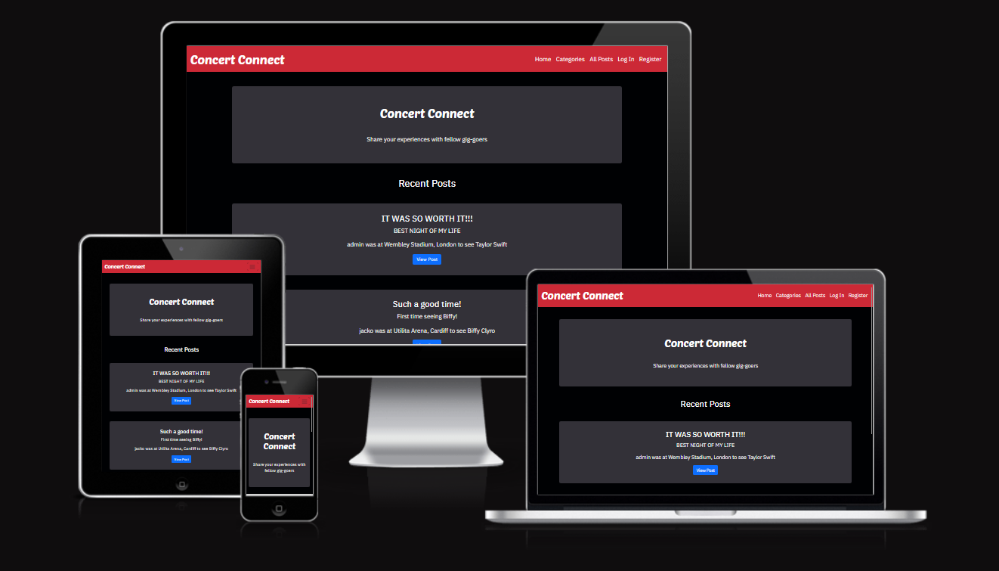
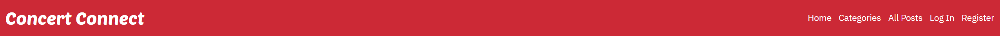
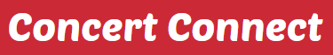

# Milestone Project 3 - Concert Connect

## Live Site

The live site for this project can be found at this link: <https://concert-connect-802cf2f5a70f.herokuapp.com>

## GitHub Repository

The GitHub Repository for this project can be found at this link: <https://github.com/99bjacko/milestone-project-3>

## Objective

In this project, I intend to create an engaging and responsive website. The goal of this website is to illustrate my passion for going to concerts, and to allow other users to do the same thing by sharing their experiences. The main objective is to demonstrate my capabilities using HTML, CSS, Python, Flask and MongoDB, creating an enjoyable experience for users of the website.

The target audience for this website is people who are similar to myself - people who love going to concerts and watching live music.

## UX

### User Stories

- As a visitor to the website, I want the navigation between pages and/or areas to be easy and intuitive, not having to rely on browser buttons.
- As a visitor to the website, I want the website to be responsive on a number of different devices.
- As a first time visitor to the website, I would like to easily view other users' posts.
- As a first time visitor to the website, I would like to be able to view all posts in a specific category.
- As a first time visitor to the website, I would like the home page to be visually appealing.
- As a first time visitor to the website, I would like to easily register for my own account, allowing me to contribute to the website.
- As a first time visitor to the website, I would like to add my own posts, allowing me to share my experience with other like-minded individuals.
- As a returning visitor to the website, I would like to be able to log in easily.
- As a returning visitor to the website, I would like to be able to log out easily.
- As a returning visitor to the website, I would like to be able to edit my existing posts.
- As a returning visitor to the website, I would like to be able to delete my existing posts.
- As a returning visitor to the website, I would like to be able to view the most recent posts, allowing me to catch up on other people's activity.
- As an administrator, I would like to be able to manage existing categories, including updating and deleting.
- As an administrator, I would like to be able to add new categories, which will become available to users adding new posts.
- As an administrator, I would like to be able to edit or delete any post on the website, reducing the risk of bad actors.

### Opportunities

Derived from user stories
| Opportunities | Importance | Viability / Feasibility |
| ------------- | ---------- | ----------------------- |
|Easy and intuitive navigation between pages and/or areas | 5 | 5 |
|Responsive and visually appealing site suitable for mobile, tablet, and desktop screen sizes | 5 | 5 |
|Allow any user, whether they are logged in or not, to view other users' posts | 5 | 5 |
|Allow any user, whether they are logged in or not, to view posts in a specific category | 4 | 4 |
|Allow users to view the most recent posts, useful for those returning to the website | 4 | 4 |
|Allow new users to easily register for their own account | 5 | 5 |
|Allow existing users to easily log in to their account | 5 | 5 |
|Allow logged in users to easily log out of their account | 5 | 5 |
|Allow users, when logged in, to add their own posts | 5 | 5 |
|Allow logged in users to edit their existing posts | 5 | 5 |
|Allow logged in users to delete their existing posts | 5 | 5 |
|Allow administrator users to manage existing categories | 5 | 5 |
|Allow administrator users to add new categories | 5 | 5 |
|Allow administrator users to edit and delete posts created by other users | 5 | 5 |

### Initial Concept

The concept for this website was very much functionality first, focusing on a good, functional user experience, whilst keeping the design visually appealing but simplistic, maintaining appropriate contrast throughout the website. The design should be kept distraction-free, focusing on the content created by the users, rather than the website itself. 

#### Wireframes

For initially designing the project, I utilised Balsamiq to produce wireframes. This step allows for planning layouts and page structures, allowing to focus more on the website looking like the designs, instead of trying to simultaneously code and design.

- [Home Page Wireframe](./static/images/documentation/home_page_wireframe.png)
- [Home Page Logged In Wireframe](./static/images/documentation/home_page_logged_in_wireframe.png)
- [Registration Page Wireframe](./static/images/documentation/registration_page_wireframe.png)
- [Login Page Wireframe](./static/images/documentation/login_page_wireframe.png)
- [All Posts Page Wireframe](./static/images/documentation/all_posts_page_wireframe.png)
- [Post Page Wireframe](./static/images/documentation/post_page_wireframe.png)
- [Add Post Page Wireframe](./static/images/documentation/add_post_page_wireframe.png)
- [Categories Page Wireframe](./static/images/documentation/categories_page_wireframe.png)
- [Categories Page Administrator View Wireframe](./static/images/documentation/categories_page_administrator_wireframe.png)
- [Add Category Page Wireframe](./static/images/documentation/add_category_page_wireframe.png)

#### Colour Scheme

The colour scheme for this project involved a lot of trial and error. I was interested in potentially using a background image for the home page, but I did not have a clear vision on what it would have been, so I decided against it. I experimented with different colour combinations, using Coolors for inspiration.

The colours used throughout this website are:
- Navigation Bar: Red `#CC2936`
- Cards: Grey `#333138`
- Background: Black `#000103`
- Buttons: Styled using Bootstrap's primary (blue), secondary (grey), info (turquoise), and danger (red) classes
- Text: White `#fff`

#### Typography

The typography for this project was picked using Google Fonts.
- Main Brand / Logo: Poetsen One
- Other Text: IBM Plex Sans

## Features

### Current Features

#### Navigation bar
    
- The design of the navigation bar is kept consistent across all pages of the website, following convention with the logo / brand text on the left hand side and navigation links on the right.
- The Navbar is the main method for navigation around the different pages of the website. The links change depending on whether a user is logged in or not.
- When logged out, the navigation bar includes links to Home, Categories, All Posts, Log In, and Register.
- When logged in , the navigation bar includes links to Home, Categories, Add Post, All Posts, and Log Out.
- The navigation bar is fully responsive with smaller screens having a collapsed menu with a navigation toggler button and larger screens having a fully expanded navigation bar.
- The navigation bar satisfies the first user story as it is easy and intuitive.
- The navigation bar satisfies the second user story as it is responsive on a number of different devices and it is visually appealing.

    

#### Logo

- The Navbar also contains the main brand logo, which is also a form of navigation, acting as a home button.

#### Home Page

- The Home Page features two main sections:
    - The first section is a card displaying the main brand image along with a comment, introducing users to the concept of the website.
        - If the user is logged in, a button for adding a post will be displayed.
    - The second section displays the most recent posts added by users, view post buttons are displayed for each post.
        - If the user is logged in and one of the recent posts was created by that specific user, buttons for editing and deleting that post will be displayed.
        - If the user logged in is an admin, buttons for editing and deleting the posts will be displayed.

- The Home Page targets the third, fifth, and twelfth user stories.

#### Categories Page

#### Add Category Page

#### Edit Category Page

#### All Posts Page

#### Registration Page

#### Log In Page

#### Log Out Function

#### Add Post Page

#### Edit Post Page

### Future Features

## Technologies Used

- [HTML5](https://en.wikipedia.org/wiki/HTML5) was used to create the website
- [CSS3](https://en.wikipedia.org/wiki/CSS) was used to style the website
- [JavaScript (through Bootstrap)](https://en.wikipedia.org/wiki/JavaScript) was used for the functionality of the website
- [Python](https://www.python.org/) was used as the back-end programming language
- [Flask](https://flask.palletsprojects.com/en/3.0.x/) was used as the Python framework, along with [Jinja](https://jinja.palletsprojects.com/en/3.1.x/) templating.
- [Bootstrap 5.3.3](https://getbootstrap.com/docs/5.0/getting-started/introduction/) was used to aid with responsive design and styling of the website
- [Gitpod](https://gitpod.io/): used to create the site (IDE)
- [Google Fonts](https://fonts.google.com/): used to import the fonts used for this website into the style.css file
- [Coolors](https://coolors.co/): used for picking a colour scheme
- [Google Developer Tools](https://developer.chrome.com/docs/devtools/): used for troubleshooting and testing
- [Git](https://git-scm.com/): used for version control by utilising the Gitpod terminal to commit to Git and push to GitHub
- [GitHub](https://github.com/): used to save and store the files for the project
- [MongoDB](https://www.mongodb.com) was used for non-relational database management with Flask
- [Heroku](https://www.heroku.com/): used for hosting the deployed back-end website
- [Balsamiq](https://balsamiq.com/): used to create the wireframes during the design process
- [Am I Responsive?](https://ui.dev/amiresponsive): used to create an image depicting what the website looks like on different devices

## Database Structure

## Testing

### Lighthouse Testing

### Manual Testing

## Deployment

### Forking the GitHub Repository

### Making a Local Clone

## Credits

### Code

### Content

### Acknowledgements
