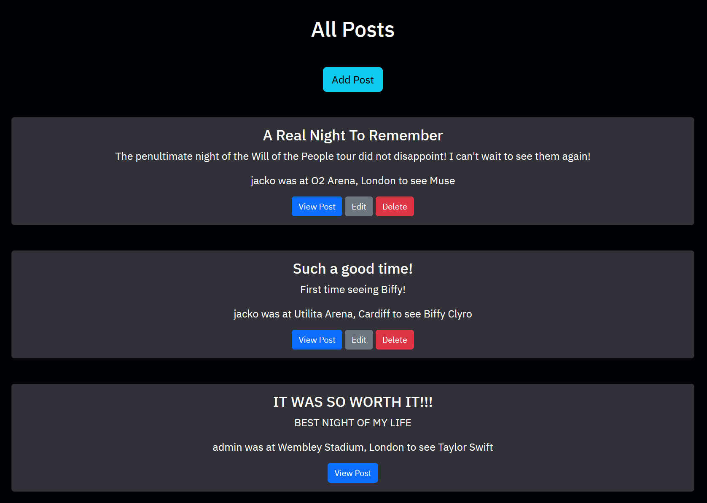
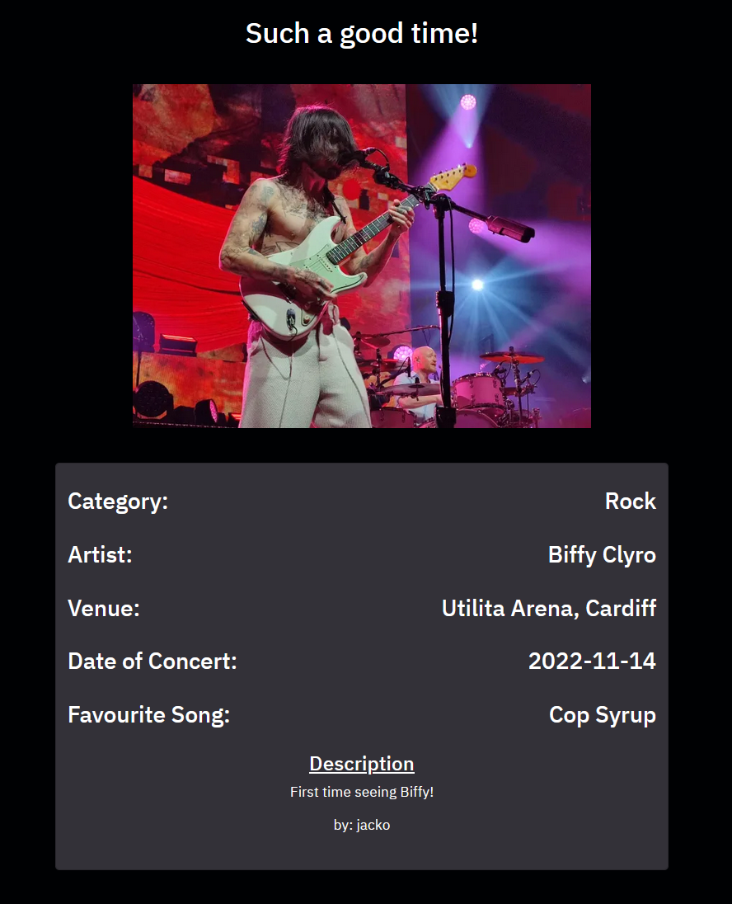

# Milestone Project 3 - Concert Connect

## Live Site

The live site for this project can be found at this link: <https://concert-connect-802cf2f5a70f.herokuapp.com>

## GitHub Repository

The GitHub Repository for this project can be found at this link: <https://github.com/99bjacko/milestone-project-3>

## Objective

In this project, I intend to create an engaging and responsive website. The goal of this website is to illustrate my passion for going to concerts, and to allow other users to do the same thing by sharing their experiences. The main objective is to demonstrate my capabilities using HTML, CSS, Python, Flask and MongoDB, creating an enjoyable experience for users of the website.

The target audience for this website is people who are similar to myself - people who love going to concerts and watching live music.

## UX

### User Stories

- As a visitor to the website, I want the navigation between pages and/or areas to be easy and intuitive, not having to rely on browser buttons.
- As a visitor to the website, I want the website to be responsive on a number of different devices.
- As a first time visitor to the website, I would like to easily view other users' posts.
- As a first time visitor to the website, I would like to be able to view all posts in a specific category.
- As a first time visitor to the website, I would like the home page to be visually appealing.
- As a first time visitor to the website, I would like to easily register for my own account, allowing me to contribute to the website.
- As a first time visitor to the website, I would like to add my own posts, allowing me to share my experience with other like-minded individuals.
- As a returning visitor to the website, I would like to be able to log in easily.
- As a returning visitor to the website, I would like to be able to log out easily.
- As a returning visitor to the website, I would like to be able to edit my existing posts.
- As a returning visitor to the website, I would like to be able to delete my existing posts.
- As a returning visitor to the website, I would like to be able to view the most recent posts, allowing me to catch up on other people's activity.
- As an administrator, I would like to be able to manage existing categories, including updating and deleting.
- As an administrator, I would like to be able to add new categories, which will become available to users adding new posts.
- As an administrator, I would like to be able to edit or delete any post on the website, reducing the risk of bad actors.

### Opportunities

Derived from user stories
| Opportunities | Importance | Viability / Feasibility |
| ------------- | ---------- | ----------------------- |
|Easy and intuitive navigation between pages and/or areas | 5 | 5 |
|Responsive and visually appealing site suitable for mobile, tablet, and desktop screen sizes | 5 | 5 |
|Allow any user, whether they are logged in or not, to view other users' posts | 5 | 5 |
|Allow any user, whether they are logged in or not, to view posts in a specific category | 4 | 4 |
|Allow users to view the most recent posts, useful for those returning to the website | 4 | 4 |
|Allow new users to easily register for their own account | 5 | 5 |
|Allow existing users to easily log in to their account | 5 | 5 |
|Allow logged in users to easily log out of their account | 5 | 5 |
|Allow users, when logged in, to add their own posts | 5 | 5 |
|Allow logged in users to edit their existing posts | 5 | 5 |
|Allow logged in users to delete their existing posts | 5 | 5 |
|Allow administrator users to manage existing categories | 5 | 5 |
|Allow administrator users to add new categories | 5 | 5 |
|Allow administrator users to edit and delete posts created by other users | 5 | 5 |

### Initial Concept

The concept for this website was very much functionality first, focusing on a good, functional user experience, whilst keeping the design visually appealing but simplistic, maintaining appropriate contrast throughout the website. The design should be kept distraction-free, focusing on the content created by the users, rather than the website itself. 

#### Wireframes

For initially designing the project, I utilised Balsamiq to produce wireframes. This step allows for planning layouts and page structures, allowing to focus more on the website looking like the designs, instead of trying to simultaneously code and design.

- [Home Page Wireframe](./static/images/documentation/home_page_wireframe.png)
- [Home Page Logged In Wireframe](./static/images/documentation/home_page_logged_in_wireframe.png)
- [Registration Page Wireframe](./static/images/documentation/registration_page_wireframe.png)
- [Login Page Wireframe](./static/images/documentation/login_page_wireframe.png)
- [All Posts Page Wireframe](./static/images/documentation/all_posts_page_wireframe.png)
- [Post Page Wireframe](./static/images/documentation/post_page_wireframe.png)
- [Add Post Page Wireframe](./static/images/documentation/add_post_page_wireframe.png)
- [Categories Page Wireframe](./static/images/documentation/categories_page_wireframe.png)
- [Categories Page Administrator View Wireframe](./static/images/documentation/categories_page_administrator_wireframe.png)
- [Add Category Page Wireframe](./static/images/documentation/add_category_page_wireframe.png)

#### Colour Scheme

The colour scheme for this project involved a lot of trial and error. I was interested in potentially using a background image for the home page, but I did not have a clear vision on what it would have been, so I decided against it. I experimented with different colour combinations, using Coolors for inspiration.

The colours used throughout this website are:
- Navigation Bar: Red `#CC2936`
- Cards: Grey `#333138`
- Background: Black `#000103`
- Buttons: Styled using Bootstrap's primary (blue), secondary (grey), info (turquoise), and danger (red) classes
- Text: White `#fff`

#### Typography

The typography for this project was picked using Google Fonts.
- Main Brand / Logo: Poetsen One
- Other Text: IBM Plex Sans

## Features

### Current Features

#### Navigation bar
    
- The design of the navigation bar is kept consistent across all pages of the website, following convention with the logo / brand text on the left hand side and navigation links on the right.
- The Navbar is the main method for navigation around the different pages of the website. The links change depending on whether a user is logged in or not.
- When logged out, the navigation bar includes links to Home, Categories, All Posts, Log In, and Register.
- When logged in , the navigation bar includes links to Home, Categories, Add Post, All Posts, and Log Out.
- The navigation bar is fully responsive with smaller screens having a collapsed menu with a navigation toggler button and larger screens having a fully expanded navigation bar.
- The navigation bar satisfies the first user story as it is easy and intuitive.
- The navigation bar satisfies the second user story as it is responsive on a number of different devices and it is visually appealing.

##### Logged Out

##### Logged In
    

##### Mobile

#### Logo

- The Navbar also contains the main brand logo, which is also a form of navigation, acting as a home button.

#### Home Page

##### Logged Out

##### Logged In

##### Administrator View

- The Home Page features two main sections:
    - The first section is a card displaying the main brand image along with a comment, introducing users to the concept of the website.
        - If the user is logged in, a button for adding a post will be displayed.
    - The second section displays the most recent posts added by users, view post buttons are displayed for each post.
        - If the user is logged in and one of the recent posts was created by that specific user, buttons for editing and deleting that post will be displayed.
        - If the user logged in is an admin, buttons for editing and deleting the posts will be displayed.

- The Home Page targets the third, fifth, and twelfth user stories.

#### Categories Page

#### Logged Out / Logged in as a regular user

##### Administrator View

- The Categories Page features categories separated onto individual cards.
- Through this page, users can view posts under specific categories.
- If an administrator is logged in, buttons for editing and deleting the categories will be displayed.
- The Categories Page targets the fourth user story.

#### View Posts By Category Page

##### Page when there are no posts found with that category name

- The View Posts By Category Page displays all of the posts in a specific category.
- The category name is displayed as a heading.
- If a user is logged in and one of the displayed posts was created by that specific user, buttons for editing and deleting that post will be displayed.
- If the user logged in is an admin, buttons for editing and deleting the posts will be displayed.
- If no posts are found, a message is displayed.
- This page targets the third and fourth user stories.

#### Add Category Page

- The Add Category Page is accessed through the Categories Page via a button, which is hidden to non-administrators.
- The Add Category Page is only accessible by an administrator.
- The page features a form with an input field and two buttons:
    - The input field is for the category name.
    - The add category button submits the category to the database.
    - The cancel button redirects the user back to the categories page.
- This page targets the fourteenth user story.

#### Edit Category Page

- The Edit Category Page is accessed through the Categories Page via a button, which is hidden to non-administrators.
- The Edit Category Page is only accessible by an administrator.
- The page features a form with an input field and two buttons:
    - The input field is for the category name and is filled by default with the current category name.
    - The edit category button updates the category in the database.
    - The cancel button redirects the user back to the categories page.
- This page targets the thirteenth user story.

#### All Posts Page

##### Logged Out

##### Logged In

##### Administrator View

- The All Posts Page can be accessed by all users
- All posts are displayed on individual cards, with view post buttons which link to the individual posts.
- If the user is logged in, a button for adding a post will be displayed underneath the heading.
- If the user is logged in and one of the posts was created by that specific user, buttons for editing and deleting that post will be displayed.
- If the user logged in is an admin, buttons for editing and deleting the posts will be displayed.
- This page targets the third user story

#### View Post Page

##### Logged In as the same user that created the post or logged in as admin

##### Logged Out or logged in as a user that didn't create the post

- The View Post Page can be accessed by all users via the "View Post" button displayed on the post cards.
- The Page displays all the necessary information related to the post:
    - The page heading is the post title.
    - The image is displayed beneath the heading.
    - The rest of the details are displayed on a card beneath the image.
- If the user is logged in and created that specific post, or if the user logged in is an administrator, buttons for editing and deleting the post will be displayed.
- This page targets the third user story.

#### Registration Page

- The registration page is accessed through the navigation bar, the link only displays to users not logged in.
- The page consists of a form with fields for username and password and a submit button to submit the data to the database.
- The form checks if the username does not already exist and also validates the username and password to ensure requirements are met.
- After registering successfully, the password is saved as a hashed password in the database.
- After registering successfully, the user is automatically logged in.
- After registering successfully, the user is redirected to the all posts page and a flash message is displayed, welcoming the user.
- This page targets the sixth user story.

#### Log In Page

- The log in page is accessed through the navigation bar, the link only displays to users not logged in.
- The page consists of a form with fields for username and password and a submit button.
- Upon clicking the button, the username and password are checked against the data stored in the database.
- After logging in successfully, the user is redirected to the home page and a flash message is displayed, welcoming the user.
- This page targets the eighth user story.

#### Log Out Function

- The log out link is only displayed to logged in users in the navigation bar.
- Upon clicking the link, the user is logged out.
- This function targets the ninth user story.

#### Add Post Page

- The Add Post page is either accessed through the buttons on the home and all posts pages or through the link in the navigation bar.
    - The buttons and link in the navigation bar are only displayed to logged in users.
- The page consists of a form with fields for all of the relevant data related to a post along with a submit button to submit the data to the database.
- The form also contains a cancel button, which redirects the user to the all posts page.
- This page targets the seventh user story.

#### Edit Post Page

- The Edit Post page is accessed through the buttons displayed on a post card.
    - These buttons are only displayed to the correct users and all administrators
- The page consists of a form with the same fields and buttons as the Add Post page, the form has been filled in by default with the pre-existing data.
- This page targets the tenth user story.

#### Error 404 Page

#### Missing Permissions Page

### Future Features

If I had more time to work on this project, some features I would like to look at are:

- Changing the formats of dates shown on the view post pages
- Allowing users to add comments to posts, including their own and other users' posts
- Allowing users to add multiple images to posts
- Improved image integration

## Technologies Used

- [HTML5](https://en.wikipedia.org/wiki/HTML5) was used to create the website
- [CSS3](https://en.wikipedia.org/wiki/CSS) was used to style the website
- [JavaScript (through Bootstrap)](https://en.wikipedia.org/wiki/JavaScript) was used for the functionality of the website
- [Python](https://www.python.org/) was used as the back-end programming language
- [Flask](https://flask.palletsprojects.com/en/3.0.x/) was used as the Python framework, along with [Jinja](https://jinja.palletsprojects.com/en/3.1.x/) templating.
- [Bootstrap 5.3.3](https://getbootstrap.com/docs/5.0/getting-started/introduction/) was used to aid with responsive design and styling of the website
- [Gitpod](https://gitpod.io/): used to create the site (IDE)
- [Google Fonts](https://fonts.google.com/): used to import the fonts used for this website into the style.css file
- [Coolors](https://coolors.co/): used for picking a colour scheme
- [Google Developer Tools](https://developer.chrome.com/docs/devtools/): used for troubleshooting and testing
- [Git](https://git-scm.com/): used for version control by utilising the Gitpod terminal to commit to Git and push to GitHub
- [GitHub](https://github.com/): used to save and store the files for the project
- [MongoDB](https://www.mongodb.com) was used for non-relational database management with Flask
- [Heroku](https://www.heroku.com/): used for hosting the deployed back-end website
- [Balsamiq](https://balsamiq.com/): used to create the wireframes during the design process
- [Am I Responsive?](https://ui.dev/amiresponsive): used to create an image depicting what the website looks like on different devices

## Database Structure

For this project, I used MongoDB, a non-relational database architecture.

My database is called concert_connect.

It contains 3 collections:

### categories

This contains the details of the categories used in the website

| Key | Type | Notes |
| --- | ---- | ----- |
| _id | ObjectId() | Automatically Generated |
| category_name | String | |

### posts

This contains the information about the posts that users add to the website

| Key | Type | Notes |
| --- | ---- | ----- |
| _id | ObjectId() | Automatically Generated |
| category_name | String | Taken from categories collection |
| artist_name | String | |
| venue | String | |
| concert_date | String | |
| favourite_song | String | |
| post_description | String | |
| post_title | String | |
| created_by | String | |
| post_image | String | | 

### users

This contains the information about the users that have signed up to the website

| Key | Type | Notes |
| --- | ---- | ----- |
| _id | ObjectId() | Automatically Generated |
| username | String | |
| password | String | Hashed Password |
| administrator | String | yes for administrator, set to no by default when registering |

## Testing

### User Stories Testing

The user stories have been tested and evaluated as shown below:
| User Story | Evaluation | Result |
| ---------- | ---------- | ------ |
| As a visitor to the website, I want the navigation between pages and/or areas to be easy and intuitive, not having to rely on browser buttons. | As a visitor to this website, I can see that the navigation between pages and/or areas is easy and intuitive using the navigation links and buttons available | PASS |
| As a visitor to the website, I want the website to be responsive on a number of different devices. | As a visitor to this website, I can see that the website is responsive on different devices as the website is appropriately structured and looks appealing on both my desktop and phone | PASS |
| As a first time visitor to the website, I would like to easily view other users' posts. | As a visitor to this website, I can easily view other users' posts via the index, all posts and view posts by category pages | PASS |
| As a first time visitor to the website, I would like to be able to view all posts in a specific category. | As a visitor to this website, I can view all posts in a specific category through the buttons on the categories page | PASS |
| As a first time visitor to the website, I would like the home page to be visually appealing. | As a visitor to this website, I believe that the home page is visually appealing and maintains sufficient contrast throughout the entire site | PASS |
| As a first time visitor to the website, I would like to easily register for my own account, allowing me to contribute to the website. | As a visitor to this website, I can easily register for my own account using the registration page | PASS |
| As a first time visitor to the website, I would like to add my own posts, allowing me to share my experience with other like-minded individuals. | As a visitor to this website, I can easily add my own posts by using the add post page when logged in | PASS |
| As a returning visitor to the website, I would like to be able to log in easily. | As a returning visitor to the website, I can easily log in using the log in page after previously registering | PASS |
| As a returning visitor to the website, I would like to be able to log out easily. | As a visitor to this website, I can easily log out using the link in the navigation bar | PASS |
| As a returning visitor to the website, I would like to be able to edit my existing posts. | As a visitor to this website, I can easily edit my existing posts using the edit post page accessed through the edit button on the relevant post cards | PASS |
| As a returning visitor to the website, I would like to be able to delete my existing posts. | As a visitor to this website, I can easily delete my existing posts using the delete button on the relevant post cards | PASS |
| As a returning visitor to the website, I would like to be able to view the most recent posts, allowing me to catch up on other people's activity. | As a returning visitor to this website, I can easily view the most recent posts as show on the index page | PASS |
| As an administrator, I would like to be able to manage existing categories, including updating and deleting. | As an administrator, I can update and delete categories through the buttons displayed on the category cards on the categories page | PASS |
| As an administrator, I would like to be able to add new categories, which will become available to users adding new posts. | As an administrator, I can add new categories through the add category form accesseed through the button displayed on the categories page | PASS |
| As an administrator, I would like to be able to edit or delete any post on the website, reducing the risk of bad actors. | As an administrator, I can easily edit existing posts using the edit post page accessed through the edit button on the post cards and delete posts through the delete button on the post cards | PASS |

### Manual Testing

The following tests were carried out for various aspects of the website using a Windows desktop using Firefox and Chrome and an iPhone 15 Pro Max using Safari.

| Feature | Expected Outcome | Testing Performed | Result |
| ------- | ---------------- | ----------------- | ------ |
| Brand Text Link | Link directs user back to index page | Clicked brand text | PASS |
| Navbar Links | Links direct user to the relevant page / function | Clicked all navbar links | PASS |
| Navbar Links | When logged out, the add post and log out links are hidden and the log in and register links are displayed | Logged out to reveal navbar link changes | PASS |
| Navbar Links | When logged in, the add post and log out links are displayed and the log in and register links are hidden | Logged in to reveal navbar link changes | PASS |
| Navbar Links | When displayed on a small screen, the navbar collapses into a hamburger menu | Viewed website on phone and resized website on desktop | PASS |
| Categories Page | When clicking the 'View Category' button, a list of posts in the category are displayed or a no posts found message is displayed | Clicked 'View Category' on a category that had existing posts. Clicked 'View Category' on a category that did not have existing posts | PASS |
| Categories Page | When an administrator is logged in, an add category button is displayed underneath the page heading and edit and delete buttons are displayed on the category cards | Logged in as an administrator | PASS |
| Categories Page | When an administrator clicks on the add category button, the add category page is displayed | Logged in as an administrator and clicked on the add category button | PASS |
| Categories Page | When an administrator clicks on the edit button on a category card, the edit category page is displayed | Logged in as an administrator and clicked on the edit button on a category card | PASS |  
| Categories Page | When an administrator clicks on the delete button on a category card, the category is deleted from the database and is no longer displayed | Logged in as an administrator and clicked on the delete button on a category card | PASS |
| Add Category Page | When an administrator tries to submit a blank form, the administrator is prompted to fill in the category name field | Logged in as an administrator and tried to submit a blank form | PASS |
| Add Category page | When an administrator completes and submits the form, the category is added to the database and is displayed on the categories page | Logged in as an administrator and submitted a correct form | PASS |
| Add Category Page | The cancel button redirects the administrator back to the categories page | Logged in as an administrator and clicked the cancel button | PASS |
| Edit Category Page | When an administrator tries to submit a blank form, the administrator is prompted to fill in the category name field | Logged in as an administrator and tried to submit a blank form | PASS |
| Edit Category Page | When an administrator completes and submits the form, the category is updated in the database and the new name is displayed on the categories page | Logged in as an administrator and submitted a correct form | PASS |
| Edit Category Page | The cancel button redirects the administrator back to the categories page | Logged in as an administrator and clicked the cancel button | PASS |
| All Posts Page | All posts in the database are shown on the page | Compared website posts to database | PASS |
| All Posts Page | When clicking the "View Post" button, the user is redirected to the page of that specific post | Clicked "View Post" button | PASS |
| All Posts Page | When logged in, the add post button is displayed and edit and delete buttons should be displayed on the post cards relevant to that user | Logged in as a non-admin user that has posted before | PASS |
| All Posts Page | When logged in as an administrator, edit and delete buttons should be displayed for all posts | Logged in as an administrator | PASS |
| All Posts Page | When logged in as an appropriate user or administrator, clicking on the edit button should redirect the user to the edit post page | Logged in as a non-admin user and an admin user and clicked on the edit button for the same post | PASS |
| All Posts Page | When logged in as an appropriate user or administrator, clicking on the delete button should delete that specific post | Logged in as a non-admin user and an admin user and clicked on the delete button for two separate posts | PASS |
| Add Post Page | When trying to submit the form with invalid data, the user is prompted to make changes and fill the form out correctly | Attempted to submit a form with invalid data | PASS |
| Add Post Page | When submitting the form with valid data, the post is added to the database and displayed on the all posts page | Submitted a form with valid data | PASS |
| Edit Post Page | When trying to submit the form with invalid data, the user is prompted to make changes and fill the form out correctly | Attempted to submit a form with invalid data | PASS |
| Edit Post Page | When submitting the form with valid data, the post is updated in the database and the changes are reflected on the relevant pages | Submitted a form with valid data | PASS |
| Registration Page | When trying to submit the form with invalid data, the user is prompted to make changes and fill the form out correctly | Attempted to submit the form with invalid data | PASS |
| Registration Page | When trying to register an account with an existing username, a message is displayed stating that the username is already in use and the page is reloaded | Attempted to submit the form with a username that is already registered | PASS |
| Registration Page | When submitting the form with valid data, the user is added to the database and the user is logged in automatically | Submitted the form with valid data | PASS |
| Log In Page | When trying to submit the form with invalid data, the user is prompted to make changes and fill the form out correctly | Attempted to submit the form with invalid data | PASS |
| Log In Page | When attempting to sign in with a username that is not registered, a message is displayed indicating that the username or password is incorrect | Attempted to submit the form with a username that is not registered | PASS |
| Log In Page | When attempting to sign in with a correct username, but the incorrect password linked to that username, a message is displayed indicating that the username or password is incorrect | Attempted to submit the form with the incorrect password for an already registered username | PASS |
| Log In Page | When submitting the form with valid data, the user is logged in | Submitted the form with valid data | PASS |
| 404 Error Page | When a user navigates to a page that does not exist / the incorrect address is entered, they are directed to a 404 page | Navigated to a page that does not exist on the website | PASS |
| Missing Permissions Page | When a non-administrator tries to navigate to a page that is admin-only, they are directed to a missing permissions page | Navigated to a page that is admin-only as a non-administrator | PASS | 

### Validation

#### HTML Validation

All pages were tested using the [W3C Nu HTML Checker](https://validator.w3.org/nu/) (previously W3C Markup Validation Service).

When initially checking the website, the HTML checker highlighted two errors and a warning:
- A section tag in the base template had the mt-3 class
- 'End tag h2 seen, but there were open elements'
    - This was due to a h1 tag having a h2 closing tag
- No heading element in the section
    - This was solved by changing the section to a div
After correcting these issues, all pages pass the HTML validation checks.

- [HTML Validation - Index](./static/images/documentation/html_validation_index.png)
- [HTML Validation - Categories Page](./static/images/documentation/html_validation_categories.png)
- [HTML Validation - View Posts by Category Page](./static/images/documentation/html_validation_view_posts_by_category.png)
- [HTML Validation - Add Category Page](./static/images/documentation/html_validation_add_category.png)
- [HTML Validation - Edit Category Page](./static/images/documentation/html_validation_edit_category.png)
- [HTML Validation - All Posts Page](./static/images/documentation/html_validation_all_posts.png)
- [HTML Validation - View Post Page](./static/images/documentation/html_validation_view_post.png)
- [HTML Validation - Registration](./static/images/documentation/html_validation_registration.png)
- [HTML Validation - Log In](./static/images/documentation/html_validation_login.png)
- [HTML Validation - Add Post](./static/images/documentation/html_validation_add_post.png)
- [HTML Validation - Edit Post](./static/images/documentation/html_validation_edit_post.png)

#### CSS Validation

The custom CSS stylesheet style.css was checked using the [W3C CSS Validation Service](https://jigsaw.w3.org/css-validator/) and no errors were found.

#### Python Validation

The app.py Python code was checked using the [CI Python Linter](https://pep8ci.herokuapp.com/). There were a few lines that were too long, which were corrected. The code now passes through the linter and is PEP8 compliant.

### Lighthouse Testing

For this project, I tested the performance, accessibility, best practices and SEO of the website using Lighthouse, one of the Chrome Developer Tools.

When initially testing using Lighthouse, the index page had an SEO score of 90 which increased after missing description and keywords were added to the head of the base template.

- [Lighthouse report for index page - desktop](./static/images/documentation/lighthouse_testing_index_desktop.pdf)
- [Lighthouse report for index page - mobile](./static/images/documentation/lighthouse_testing_index_mobile.pdf)
- [Lighthouse report for categories page - desktop](./static/images/documentation/lighthouse_testing_categories_desktop.pdf)
- [Lighthouse report for categories page - mobile](./static/images/documentation/lighthouse_testing_categories_mobile.pdf)
- [Lighthouse report for view posts by category page - desktop](./static/images/documentation/lighthouse_testing_view_posts_by_category_desktop.pdf)
- [Lighthouse report for view posts by category page - mobile](./static/images/documentation/lighthouse_testing_view_posts_by_category_mobile.pdf)
- [Lighthouse report for add category page - desktop](./static/images/documentation/lighthouse_testing_add_category_desktop.pdf)
- [Lighthouse report for add category page - mobile](./static/images/documentation/lighthouse_testing_add_category_mobile.pdf)
- [Lighthouse report for edit category page - desktop](./static/images/documentation/lighthouse_testing_edit_category_desktop.pdf)
- [Lighthouse report for edit category page - mobile](./static/images/documentation/lighthouse_testing_edit_category_mobile.pdf)
- [Lighthouse report for all posts page - desktop](./static/images/documentation/lighthouse_testing_all_posts_desktop.pdf)
- [Lighthouse report for all posts page - mobile](./static/images/documentation/lighthouse_testing_all_posts_mobile.pdf)
- [Lighthouse report for view post page - desktop](./static/images/documentation/lighthouse_testing_view_post_desktop.pdf)
- [Lighthouse report for view post page - mobile](./static/images/documentation/lighthouse_testing_view_post_mobile.pdf)
- [Lighthouse report for registration page - desktop](./static/images/documentation/lighthouse_testing_registration_desktop.pdf)
- [Lighthouse report for registration page - mobile](./static/images/documentation/lighthouse_testing_registration_mobile.pdf)
- [Lighthouse report for log in page - desktop](./static/images/documentation/lighthouse_testing_login_desktop.pdf)
- [Lighthouse report for log in page - mobile](./static/images/documentation/lighthouse_testing_login_mobile.pdf)
- [Lighthouse report for add post page - desktop](./static/images/documentation/lighthouse_testing_add_post_desktop.pdf)
- [Lighthouse report for add post page - mobile](./static/images/documentation/lighthouse_testing_add_post_mobile.pdf)
- [Lighthouse report for edit post page - desktop](./static/images/documentation/lighthouse_testing_edit_post_desktop.pdf)
- [Lighthouse report for edit post page - mobile](./static/images/documentation/lighthouse_testing_edit_post_mobile.pdf)

## Known Bugs

- Datepicker value on edit post page not being inserted on posts that were already in the database created through the MongoDB website.

## Deployment

The site was deployed using GitHub and is hosted on [Heroku](https://concert-connect-802cf2f5a70f.herokuapp.com/).

### Forking the GitHub Repository

Forking the GitHub repository allows a copy of the original repository to be made without affecting the original repository. This can be achieved by following these steps:

1. Log in to GitHub
2. Navigate to the GitHub repository for this project, milestone-project-3
3. Click the Fork button in the top right corner

### Making a Local Clone

1. Log in to GitHub
2. Navigate to the GitHub repository for this project, milestone-project-3
3. To clone the repository using HTTPS, copy the link under "Clone with HTTPS"
4. Open a GitBash terminal and navigate to the location you want to use for the cloned directory
5. Use the git clone command with the URL copied in Step 3

### MongoDB Database Setup

To get your own [MongoDB](https://www.mongodb.com) Database URI, sign up on their [website](https://www.mongodb.com) and follow these steps:

1. Create your database's name (e.g. concert_connect).
2. Create the collection(s) for the database (e.g. categories, posts, users)
3. Insert the appropriate documents into the collections as detailed in the database section previously.
4. Click on the Overview tab under the Cluster created for this project.
5. Click on the Connect button.
6. Click Connect Your Application (Drivers).
7. Copy the connection string, replacing `<password>` with the password you have created.

### Deploying Locally

If you are deploying the application locally, you will need to create an env.py file. An example can be found [here](./sample_env.py).

Do not commit your env.py file to GitHub as it contains sensitive information. This can be done by adding the env.py file to a .gitignore file.

### Deploying to Heroku

To deploy your application to [Heroku](https://www.heroku.com/), sign up on their [website](https://www.heroku.com/) and follow these steps:

1. Select "New" > "Create New App"
2. Create a unique app name and select the server region closest to you
3. Select "Create App"
4. In the new app, select "Settings"
5. Select "Review Config Vars"
6. Enter the environment variables:

| Key | Value |
| --- | ----- |
| IP | 0.0.0.0 |
| PORT | 5000 |
| SECRET_KEY | Your secret key |
| MONGO_URI | Your MongoDB URI |
| MONGO_DBNAME | Your MongoDB database name |

7. Create the Procfile in the terminal `echo web: python app.py > Procfile`
8. Create the requirements.txt file in the terminal: `pip3 freeze --local > requirements.txt`

To connect the GitHub repository to the Heroku App:

1. Go to the app in Heroku
2. Go to the "Deploy" tab
3. Under "Connect to GitHub", search for your repository and click "Connect"
4. Enable Automatic Deployment to update the app every time you commit to GitHub.

## Credits

### Code

- [Bootstrap 5.3.3](https://getbootstrap.com/docs/5.0/getting-started/introduction/) was used throughout the project, utilising the built in Grid System to ensure that the site is responsive across multiple devices.

### Content

- Example post content was created by the developer.
- Example post image from [Mojo4Music](https://www.mojo4music.com/articles/stories/taylor-swift-live-review/)
- Example post image from [OriginalRock](https://originalrock.net/2022/11/15/live-review-biffy-clyro-at-cardiff-motorpoint-arena/)

### Acknowledgements

- Code Institute for all course material
- Code Institute Slack community for assistance and guidance on the project
- My mentor, Rahul, and my cohort facilitator, Amy, for providing feedback and encouragement throughout the process.
